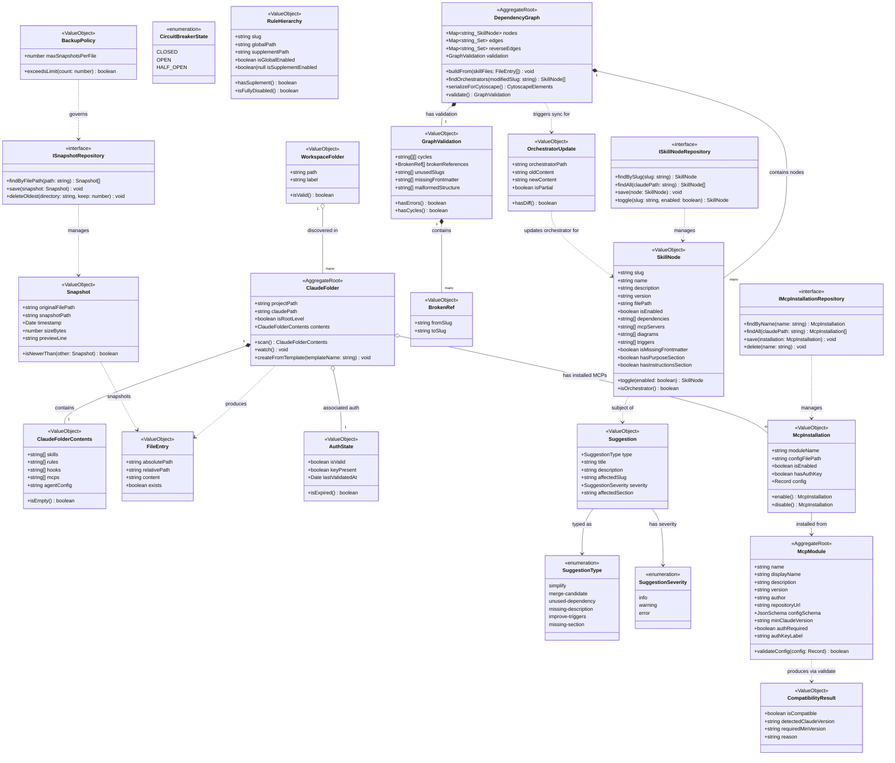

# Class Diagram — Claude Project Manager

**Status:** Draft
**Date:** 2026-03-21
**Service:** claude-project-manager
**Bounded context:** ProjectDiscovery · SkillManagement · OrchestratorSync · BackupAndRestore · MCPManagement · AIAssistance

---

## Specs Read

| Spec | File | Used for |
|---|---|---|
| Service spec (main-process) | `docs/architecture/service-main-process.md` | WorkspaceFolder, ClaudeFolder, ClaudeFolderContents, use cases |
| Service spec (skill-graph-service) | `docs/architecture/service-skill-graph-service.md` | SkillNode, DependencyGraph, GraphValidation, BrokenRef |
| Service spec (ai-suggestion-service) | `docs/architecture/service-ai-suggestion-service.md` | Suggestion, OrchestratorUpdate, AuthState |
| Service spec (backup-service) | `docs/architecture/service-backup-service.md` | Snapshot, BackupPolicy |
| Service spec (mcp-manager) | `docs/architecture/service-mcp-manager.md` | McpModule, McpInstallation, CompatibilityResult |
| Service spec (renderer-process) | `docs/architecture/service-renderer-process.md` | Presentation layer only — no domain classes |
| System spec | `docs/architecture/system-claude-project-manager.md` | Bounded context boundaries, IPC event topology |
| ADR 0008 | `docs/adr/0008-skill-rule-file-format.md` | Frontmatter schema → SkillNode fields |
| Event specs | `docs/events/*-spec.md` (6 specs) | DomainEvent classification; push payload field verification |
| API spec | `docs/api/ipc-channels-api.md` | IPC channel ownership verification per module |
| Resilience spec | `docs/architecture/resilience-claude-project-manager.md` | CircuitBreakerState enum; timeout values |

---

## Domain Model

---

## Relationship Key

| Symbol | Meaning |
|---|---|
| `*--` | Composition (child owned, lifecycle-bound to parent) |
| `o--` | Aggregation (referenced, independent lifecycle) |
| `-->` | Association (uses / typed as) |
| `..>` | Dependency (produces / manages / triggers) |
| `<\|--` | Inheritance |
| `<\|..` | Interface implementation |

---

## Notes

**Aggregate roots per bounded context:**
- `ClaudeFolder` — ProjectDiscovery: the central entity; all file paths and contents hang off it
- `DependencyGraph` — SkillManagement: owns all nodes, edges, and validation state; rebuilt on every `config:changed`
- `McpModule` — MCPManagement: registry entry; `McpInstallation` is a value object derived from it

**Aggregate invariants:**
- `DependencyGraph`: every edge target must exist as a node slug or be recorded as a `BrokenRef`
- `ClaudeFolder`: `claudePath` must be a subdirectory of `projectPath`
- `McpInstallation`: `config` must satisfy `McpModule.configSchema` before write
- `SkillNode`: `slug` must equal the parent directory name (validated by `FrontmatterParser`)
- `BackupPolicy.maxSnapshotsPerFile` enforced after every `SnapshotFileUseCase` call

**PII fields:**
- `AuthState` — the API key itself is NOT stored in any domain object; it lives in the OS keychain only. `AuthState.keyPresent` is a boolean flag only.
- `McpInstallation.config` must never contain auth keys — `hasAuthKey` is a boolean pointer to the keychain entry only.

**Enable/disable toggle affects:**
- `SkillNode.isEnabled` — written to `enabled: false` in SKILL.md frontmatter (field removed on re-enable)
- `McpInstallation.isEnabled` — written to `enabled` field in MCP JSON config

**Sequence diagrams** (all written):
- [x] `docs/diagrams/claude-project-manager-sequence-scan-workspace.md`
- [x] `docs/diagrams/claude-project-manager-sequence-edit-skill-and-sync.md`
- [x] `docs/diagrams/claude-project-manager-sequence-rollback-file.md`
- [x] `docs/diagrams/claude-project-manager-sequence-install-mcp.md`
- [x] `docs/diagrams/claude-project-manager-sequence-generate-suggestions.md`
- [x] `docs/diagrams/claude-project-manager-sequence-validate-api-key.md`

**State diagrams** (all written):
- [x] `docs/diagrams/claude-project-manager-state-skill-node.md`
- [x] `docs/diagrams/claude-project-manager-state-mcp-installation.md`
- [x] `docs/diagrams/claude-project-manager-state-auth-state.md`
- [x] `docs/diagrams/claude-project-manager-state-orchestrator-update.md`
- [x] `docs/diagrams/claude-project-manager-state-circuit-breaker.md`
