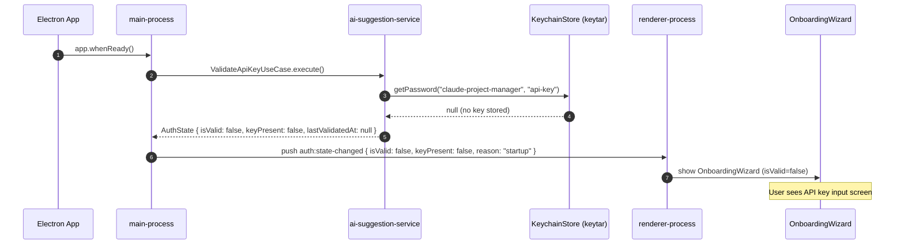
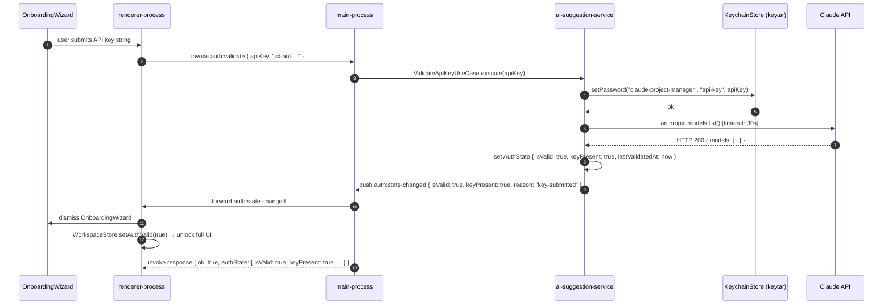
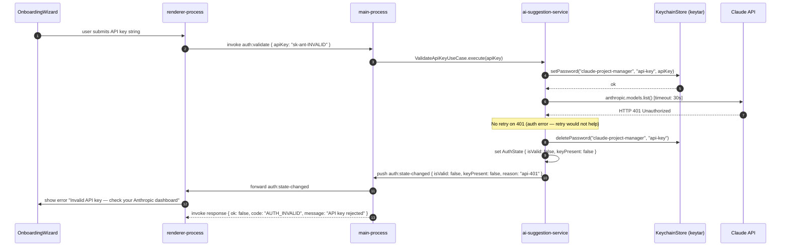
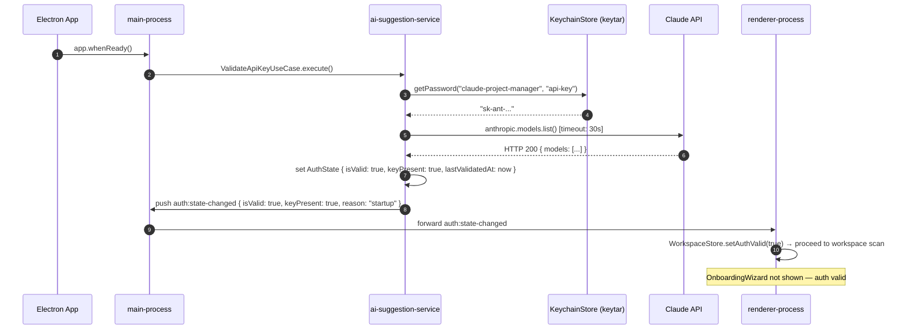

# Sequence Diagram — Validate API Key (OnboardingWizard Flow)

**Status:** Draft
**Date:** 2026-03-21
**Service:** claude-project-manager
**Use case:** `ValidateApiKeyUseCase` — app startup auth gate + user key submission via OnboardingWizard

---

## Specs Read

| Spec | File | Used for |
|---|---|---|
| Service spec (ai-suggestion-service) | `docs/architecture/service-ai-suggestion-service.md` | ValidateApiKeyUseCase, AuthState, AnthropicClient |
| Service spec (main-process) | `docs/architecture/service-main-process.md` | App startup orchestration, IPC handler |
| Service spec (renderer-process) | `docs/architecture/service-renderer-process.md` | OnboardingWizard, WorkspaceStore |
| Event spec | `docs/events/auth-state-changed-spec.md` | auth:state-changed payload and reason values |
| API spec | `docs/api/ipc-channels-api.md` | auth:validate channel, auth:state-changed push |
| Resilience spec | `docs/architecture/resilience-claude-project-manager.md` | Timeout 30s, no retry on 401/403 |

---

## Flow A — App Startup (no key stored)



---

## Flow B — User Submits API Key (success)



---

## Flow C — User Submits Invalid API Key (401)



---

## Flow D — App Startup (key stored, valid)



---

## Flow E — Key Stored but Network Unavailable at Startup

```mermaid
sequenceDiagram
    autonumber
    participant App as Electron App
    participant Main as main-process
    participant AIS as ai-suggestion-service
    participant KC as KeychainStore (keytar)
    participant Claude as Claude API
    participant Renderer as renderer-process
    participant OW as OnboardingWizard

    App->>Main: app.whenReady()
    Main->>AIS: ValidateApiKeyUseCase.execute()
    AIS->>KC: getPassword("claude-project-manager", "api-key")
    KC-->>AIS: "sk-ant-..."

    AIS->>Claude: anthropic.models.list() [timeout: 30s]
    Note over Claude: Network unreachable / timeout
    Claude-->>AIS: ECONNREFUSED / timeout after 30s

    Note over AIS: 3× retry with exponential backoff (5xx/network only)
    AIS->>Claude: retry 1 (backoff ~1s + jitter)
    Claude-->>AIS: ECONNREFUSED
    AIS->>Claude: retry 2 (backoff ~2s + jitter)
    Claude-->>AIS: ECONNREFUSED

    AIS->>AIS: set AuthState { isValid: false, keyPresent: true }
    AIS->>Main: push auth:state-changed { isValid: false, keyPresent: true, reason: "startup" }
    Main->>Renderer: forward auth:state-changed
    Renderer->>OW: show OnboardingWizard with "Unable to reach Claude API — check your connection" message
    Note over OW: Key is present; user can retry without re-entering key
```

---

## Notes

- **API key never in IPC payloads**: `auth:validate` accepts `apiKey?` only on explicit user submission (from OnboardingWizard). Startup validation reads the key from the OS keychain directly — the renderer never holds the raw key.
- **Key stored before validation**: The key is written to keychain before the validation call (Flow B, step 4). If validation fails (401), the key is immediately deleted from keychain (Flow C, step 9). This avoids a second keychain write on success.
- **`keyPresent` vs `isValid`**: A key can be present but invalid (wrong key, 401) or present but unverified (network down). `keyPresent` reflects keychain state; `isValid` reflects the most recent successful API call.
- **OnboardingWizard retry**: When a key is already present (`keyPresent: true`) but `isValid: false` due to a network error, the wizard shows a "Retry" button that re-invokes `auth:validate` without a `apiKey` argument — the service reads the stored key from the keychain.
