# State Diagram — AuthState

**Status:** Draft
**Date:** 2026-03-21
**Entity:** AuthState (ai-suggestion-service domain)
**Depends on:** `docs/diagrams/claude-project-manager-class.md`

---

## Specs Read

| Spec | File | Used for |
|---|---|---|
| Class diagram | `docs/diagrams/claude-project-manager-class.md` | AuthState.isValid, keyPresent, lastValidatedAt |
| Service spec (ai-suggestion-service) | `docs/architecture/service-ai-suggestion-service.md` | ValidateApiKeyUseCase, circuit breaker interaction |
| Service spec (renderer-process) | `docs/architecture/service-renderer-process.md` | OnboardingWizard, status bar |

---

## Diagram

```mermaid
stateDiagram-v2
    [*] --> KeyMissing : App startup\nkeytar.getPassword() returns null\n/ OnboardingWizard shown

    [*] --> Validating : App startup\nkeytar.getPassword() returns non-null string\n/ ValidateApiKeyUseCase starts

    KeyMissing --> Validating : User submits API key in OnboardingWizard\n/ keytar.setPassword() stores key\n/ ValidateApiKeyUseCase starts

    Validating --> Valid : anthropic.models.list() returns 200\n/ AuthState(isValid=true, keyPresent=true)\n/ auth:state-changed IPC emitted\n/ App unlocked; scan and suggestions enabled

    Validating --> InvalidKey : anthropic.models.list() returns 401 or 403\n/ AuthState(isValid=false, keyPresent=true)\n/ auth:state-changed IPC emitted\n/ OnboardingWizard shown with error

    Validating --> NetworkError : Network timeout or 5xx after 3 retries\n/ AuthState(isValid=false, keyPresent=true)\n/ auth:state-changed IPC emitted\n/ Status bar shows "Cannot reach Claude API"

    InvalidKey --> Validating : User corrects API key in settings\n/ keytar.setPassword() overwrites old key\n/ ValidateApiKeyUseCase re-runs

    InvalidKey --> KeyMissing : User deletes API key in settings\n/ keytar.deletePassword()\n/ OnboardingWizard shown

    NetworkError --> Validating : User clicks "Retry" in status bar\n/ ValidateApiKeyUseCase re-runs

    Valid --> Validating : User rotates API key in settings\n/ keytar.setPassword() with new key\n/ ValidateApiKeyUseCase re-runs

    Valid --> InvalidKey : Claude API returns 401 on any subsequent call\n/ ValidateApiKeyUseCase triggered immediately\n/ auth:state-changed emitted

    Valid --> NetworkError : Circuit breaker opens (5 consecutive failures)\n/ auth:state-changed with network-error flag\n/ All AI features suspended

    NetworkError --> Valid : Circuit breaker half-open after 60s\n/ Retry probe succeeds (200 OK)\n/ auth:state-changed (isValid=true)\n/ AI features resume
```

---

## State Descriptions

| State | `isValid` | `keyPresent` | App behaviour |
|---|---|---|---|
| `KeyMissing` | false | false | OnboardingWizard shown; app blocked |
| `Validating` | false | true | Loading spinner in status bar; app partially available |
| `Valid` | true | true | Full app functionality available |
| `InvalidKey` | false | true | OnboardingWizard shown with error; app blocked |
| `NetworkError` | false | true | Status bar warning; local features work; AI features suspended |

---

## Guard Conditions

- `KeyMissing → Validating`: requires non-empty API key string from user
- `Valid → Validating` (key rotation): requires new key string different from stored key
- `NetworkError → Valid` (circuit half-open): probe request must return 200 within 30s timeout

---

## Side Effects

| Transition | Side effect |
|---|---|
| Any → `Valid` | `auth:state-changed` IPC emitted → renderer hides OnboardingWizard, enables sidebar |
| Any → `InvalidKey` | `auth:state-changed` IPC emitted → renderer shows OnboardingWizard with "Invalid key" error |
| Any → `KeyMissing` | `auth:state-changed` IPC emitted → renderer shows OnboardingWizard |
| `Valid → NetworkError` | Circuit breaker OPEN; all pending Claude API calls fail immediately |
| `NetworkError → Valid` | Circuit breaker CLOSED; queued suggestion/sync requests resume |

---

## Notes

- The API key itself never appears in `AuthState` — only a boolean `keyPresent` flag
- `ValidateApiKeyUseCase` uses `anthropic.models.list()` as the cheapest possible validation call
- `NetworkError` state does not clear the stored keychain entry — the key may still be valid once connectivity is restored
- App startup always enters `KeyMissing` or `Validating` — never assumes a previously valid state persists across restarts
