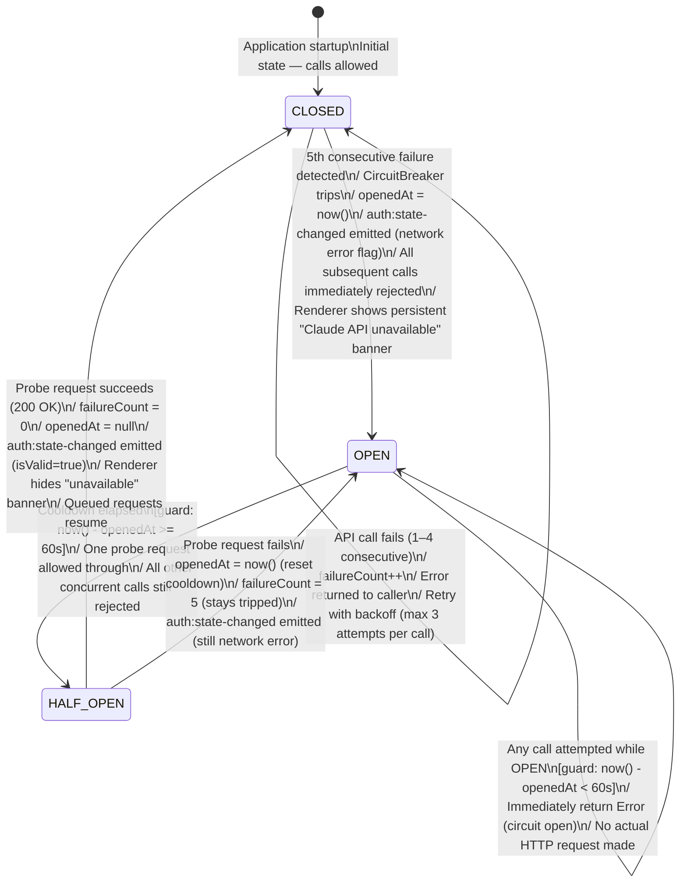

# State Diagram — CircuitBreakerState

**Status:** Draft
**Date:** 2026-03-21
**Entity:** CircuitBreakerState (ai-suggestion-service infrastructure — AnthropicClient)
**Depends on:** `docs/diagrams/claude-project-manager-class.md`

---

## Specs Read

| Spec | File | Used for |
|---|---|---|
| Class diagram | `docs/diagrams/claude-project-manager-class.md` | CircuitBreakerState enumeration |
| Service spec (ai-suggestion-service) | `docs/architecture/service-ai-suggestion-service.md` | Circuit breaker thresholds, cooldown |
| System spec | `docs/architecture/system-claude-project-manager.md` | Resilience baseline — 5 failures / 60s cooldown |

---

## Diagram

---

## State Descriptions

| State | Calls allowed? | HTTP requests made? | Renderer effect |
|---|---|---|---|
| `CLOSED` | Yes | Yes (with retry) | Normal — suggestions and sync available |
| `OPEN` | No | No | Persistent "Claude API unavailable" banner; retry button shown |
| `HALF_OPEN` | One probe only | One probe request | Banner still shown; "Retrying…" indicator |

---

## Thresholds (from service spec)

| Parameter | Value |
|---|---|
| Failure threshold to open | 5 consecutive failures |
| Cooldown before HALF_OPEN | 60 seconds |
| Probe timeout | 30 seconds |
| Retry per call (CLOSED only) | Max 3 attempts, exponential backoff + jitter |
| No retry on | 401, 403, 429 |

---

## Guard Conditions

- `OPEN → OPEN` (stay open): `now() - openedAt < 60s`
- `OPEN → HALF_OPEN`: `now() - openedAt >= 60s` AND a new call is attempted
- `HALF_OPEN → CLOSED`: probe response status 200
- `HALF_OPEN → OPEN`: probe response non-200, or timeout, or network error

---

## Side Effects

| Transition | Side effect |
|---|---|
| `CLOSED → OPEN` | `auth:state-changed` IPC (network error); renderer shows persistent banner |
| `HALF_OPEN → CLOSED` | `auth:state-changed` IPC (isValid=true); queued requests processed |
| `HALF_OPEN → OPEN` | `auth:state-changed` IPC (still network error); cooldown resets |

---

## Notes

- The circuit breaker protects all Claude API calls: `GenerateSuggestionsUseCase`, `SyncOrchestratorUseCase`, and `ValidateApiKeyUseCase`
- 401/403 responses are auth errors — they do NOT increment the circuit breaker failure count; they trigger `ValidateApiKeyUseCase` instead
- 429 responses do NOT increment the failure count — they trigger the `retry-after` header delay
- Only 5xx responses and network errors (timeout, connection refused) count as circuit breaker failures
- `AnthropicClient` is the only class that owns the circuit breaker state — no other module inspects or mutates it directly
