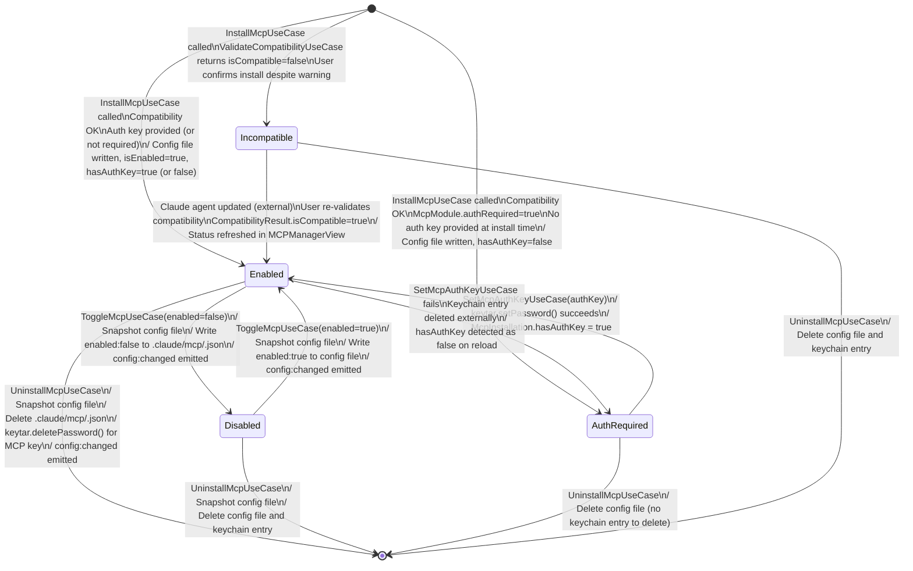

# State Diagram — McpInstallation

**Status:** Draft
**Date:** 2026-03-21
**Entity:** McpInstallation (mcp-manager domain)
**Depends on:** `docs/diagrams/claude-project-manager-class.md`

---

## Specs Read

| Spec | File | Used for |
|---|---|---|
| Class diagram | `docs/diagrams/claude-project-manager-class.md` | McpInstallation, CompatibilityResult |
| Service spec (mcp-manager) | `docs/architecture/service-mcp-manager.md` | InstallMcpUseCase, ToggleMcpUseCase, SetMcpAuthKeyUseCase, UninstallMcpUseCase |

---

## Diagram

---

## State Descriptions

| State | Condition | UI appearance |
|---|---|---|
| `Enabled` | `isEnabled=true`, `hasAuthKey=true` (or auth not required) | Green badge, active in MCP list |
| `Disabled` | `isEnabled=false` | Grey badge, disabled toggle |
| `AuthRequired` | `isEnabled=true`, `hasAuthKey=false`, `authRequired=true` | Yellow warning badge, "Auth key missing" label |
| `Incompatible` | Installed but `CompatibilityResult.isCompatible=false` | Orange warning badge, "Incompatible version" label |

---

## Guard Conditions

- `InstallMcpUseCase` guard: `configSchema` validation must pass
- `ToggleMcpUseCase` guard: config file must exist on disk
- `UninstallMcpUseCase` guard: user must confirm uninstall (destructive action)
- `SetMcpAuthKeyUseCase` guard: `authKey` must be non-empty string

---

## Side Effects

| Transition | Side effect |
|---|---|
| Any install/uninstall | `config:changed` emitted → graph re-parses `mcp_servers` in skill frontmatter |
| `Enabled → Disabled` / `Disabled → Enabled` | Config file snapshotted by backup-service before write |
| `Any → [*]` (uninstall) | Keychain entry deleted; config file snapshotted before deletion |
| `AuthRequired → Enabled` | Only keychain write; no file write; no backup snapshot needed |

---

## Notes

- `Incompatible` state does not block installation — it is a warning state that the user can override
- `AuthRequired` state means the MCP is installed and enabled in config but cannot authenticate to its external service until a key is provided via `SetMcpAuthKeyUseCase`
- Config file and keychain operations are atomic: if config write fails, no keychain write is attempted; if keychain write fails after config write, `hasAuthKey=false` is surfaced
- `Disabled` MCPs remain installed on disk and can be re-enabled instantly
