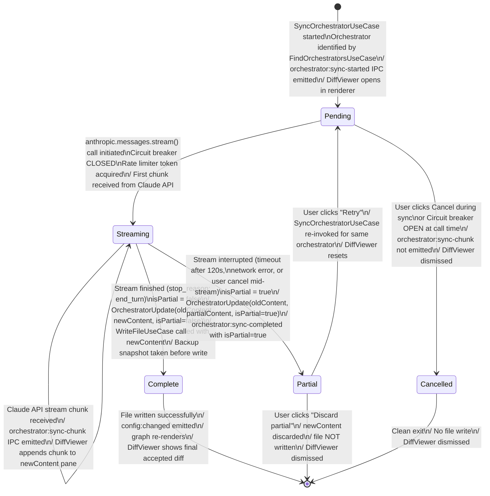

# State Diagram — OrchestratorUpdate

**Status:** Draft
**Date:** 2026-03-21
**Entity:** OrchestratorUpdate (ai-suggestion-service domain)
**Depends on:** `docs/diagrams/claude-project-manager-class.md`

---

## Specs Read

| Spec | File | Used for |
|---|---|---|
| Class diagram | `docs/diagrams/claude-project-manager-class.md` | OrchestratorUpdate.isPartial |
| Service spec (ai-suggestion-service) | `docs/architecture/service-ai-suggestion-service.md` | SyncOrchestratorUseCase, streaming |
| Sequence diagram | `docs/diagrams/claude-project-manager-sequence-edit-skill-and-sync.md` | Full sync flow |

---

## Diagram

---

## State Descriptions

| State | `isPartial` | File written? | DiffViewer state |
|---|---|---|---|
| `Pending` | — | No | Opening, spinner shown |
| `Streaming` | — | No | Live stream appending to right pane |
| `Complete` | false | Yes (after backup) | Final diff shown; read-only |
| `Partial` | true | No (user decides) | Partial diff with warning banner |
| `Cancelled` | — | No | Dismissed |

---

## Guard Conditions

- `Pending → Streaming`: circuit breaker must be CLOSED; rate limiter must grant token
- `Streaming → Complete`: Claude API `stop_reason` must be `end_turn` (not `max_tokens`)
- `Partial → Pending` (retry): circuit breaker must be CLOSED; rate limiter must grant token

---

## Side Effects

| Transition | Side effect |
|---|---|
| `[*] → Pending` | `orchestrator:sync-started` IPC emitted with orchestratorPath |
| `Streaming → *` per chunk | `orchestrator:sync-chunk` IPC emitted (orchestratorPath + chunkText) |
| `Streaming → Complete` | `SnapshotFileUseCase` runs on orchestrator file before write; `WriteFileUseCase` writes newContent |
| `Complete → [*]` | `config:changed` → `BuildGraphUseCase` → graph re-renders |
| `Streaming → Partial` | Circuit breaker records failure if caused by API error |

---

## Notes

- One `OrchestratorUpdate` instance is created per affected orchestrator file; multiple orchestrators are processed sequentially
- `Partial` state gives the user control — they can review the incomplete diff and choose to retry or discard
- `Complete` state always implies a backup snapshot was created before the file write
- If `stop_reason` is `max_tokens` (output truncated), the update is treated as `Partial` since the orchestrator content may be incomplete
