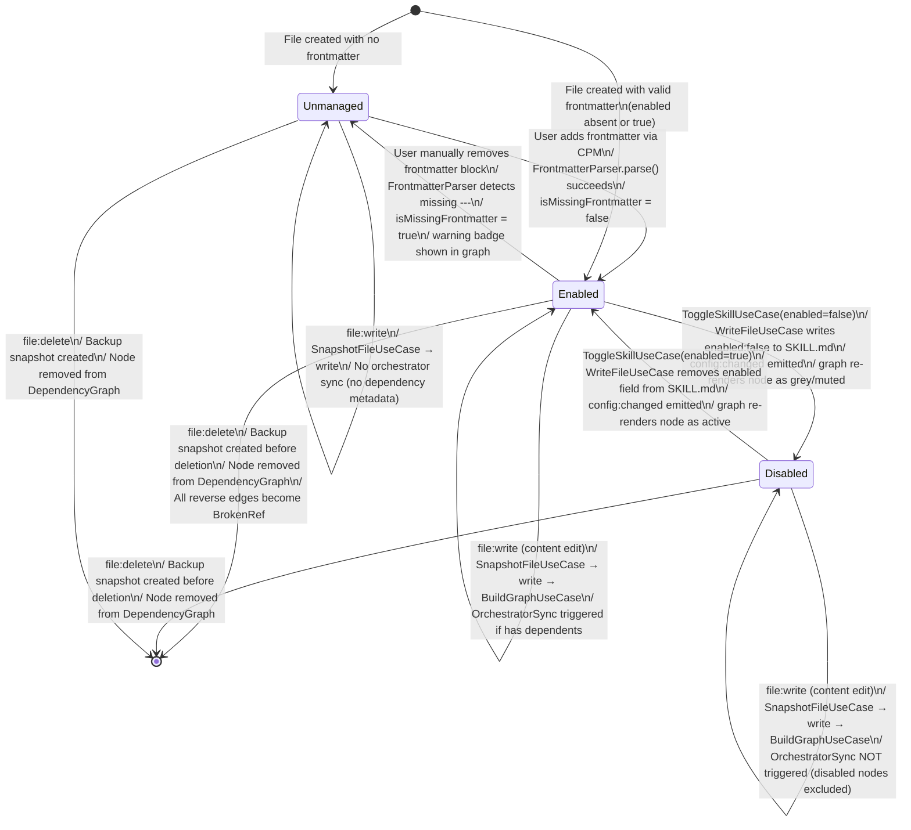

# State Diagram — SkillNode

**Status:** Draft
**Date:** 2026-03-21
**Entity:** SkillNode (skill-graph-service domain)
**Depends on:** `docs/diagrams/claude-project-manager-class.md`

---

## Specs Read

| Spec | File | Used for |
|---|---|---|
| Class diagram | `docs/diagrams/claude-project-manager-class.md` | SkillNode.isEnabled, isMissingFrontmatter |
| Service spec (skill-graph-service) | `docs/architecture/service-skill-graph-service.md` | SkillNode states, FrontmatterParser |
| Service spec (main-process) | `docs/architecture/service-main-process.md` | ToggleSkillUseCase, WriteFileUseCase |
| ADR 0008 | `docs/adr/0008-skill-rule-file-format.md` | enabled frontmatter field semantics |

---

## Diagram

---

## State Descriptions

| State | Condition | Graph appearance | Orchestrator sync? |
|---|---|---|---|
| `Enabled` | Frontmatter present, `enabled` absent or `true` | Blue/purple node, full opacity | Yes — if has dependents |
| `Disabled` | Frontmatter present, `enabled: false` | Grey node, 35% opacity, edges dimmed | No — excluded from sync targets |
| `Unmanaged` | No `---` frontmatter block detected | Node with warning badge, dashed border | No — no dependency metadata |

---

## Guard Conditions

- `ToggleSkillUseCase(enabled=false)` guard: file must exist on disk
- `ToggleSkillUseCase(enabled=true)` guard: file must exist on disk; `enabled: false` must be present in current frontmatter
- `file:delete` guard: user must confirm deletion in UI (destructive action)

---

## Side Effects

| Transition | Side effect |
|---|---|
| Any → any (file write) | `SnapshotFileUseCase` runs first; aborts on failure |
| Enabled → Disabled | `config:changed` → `BuildGraphUseCase` → graph re-renders |
| Disabled → Enabled | `config:changed` → `BuildGraphUseCase` → orchestrator sync re-enabled for this node |
| Any → `[*]` (delete) | `BrokenRef` entries added for all reverse-edge slugs; renderer shows broken edges in red |

---

## Notes

- `Unmanaged` is a degraded state — CPM will offer a migration wizard to add frontmatter
- `Disabled` skills appear in the graph but are visually muted; they remain on disk and can be re-enabled at any time
- Re-enabling removes `enabled: false` from frontmatter entirely — file returns to clean default state
- Rollback via `RollbackUseCase` can restore a previously enabled/disabled state by restoring an earlier SKILL.md snapshot
